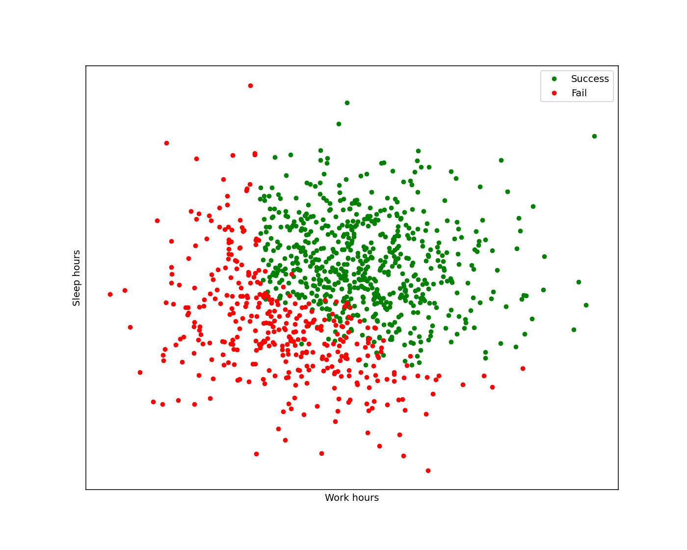
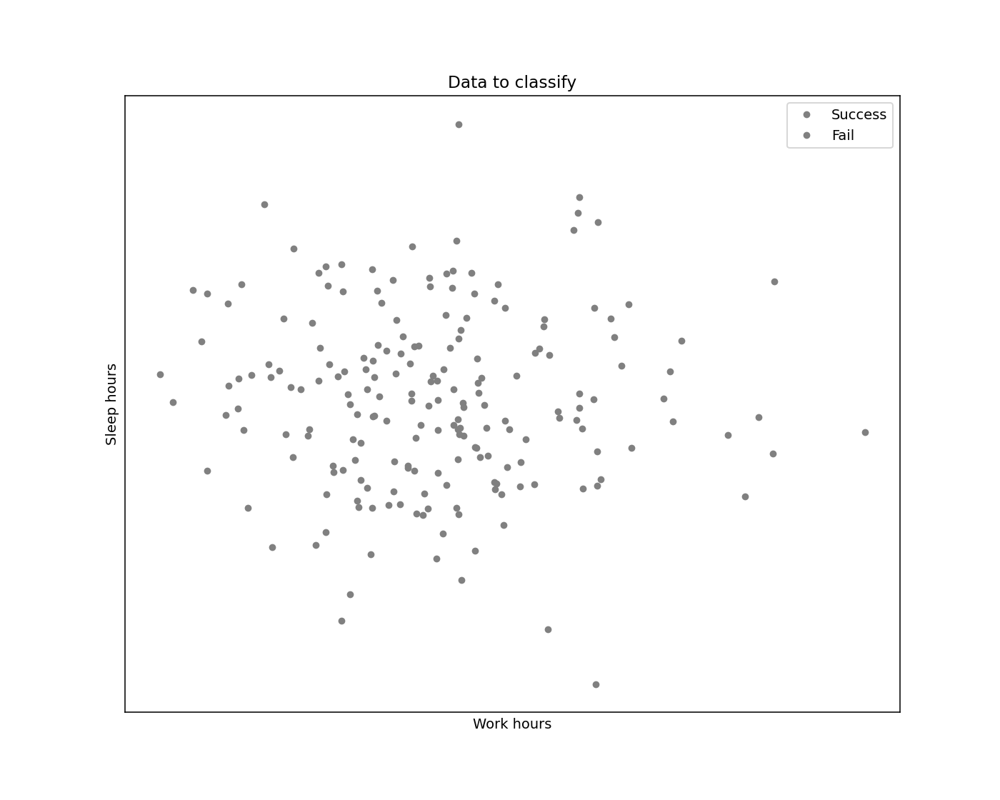
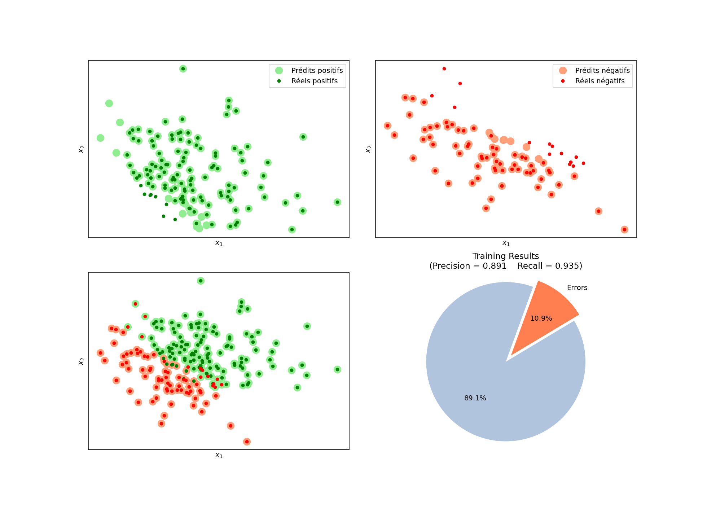
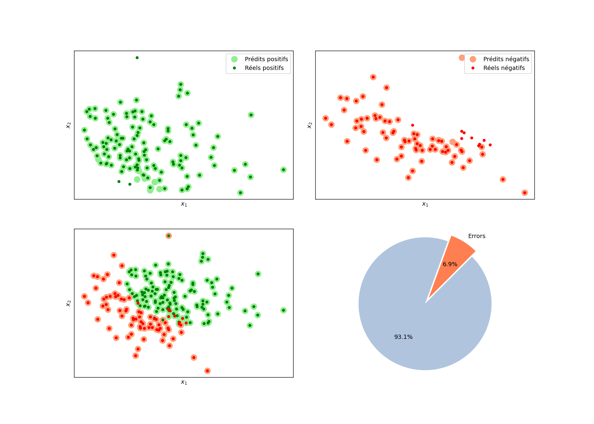

# Logistic Regression
This repository contains an implementation of Logistic Regression using Python and NumPy. 
The implementation includes data generation, normalization, model training, and evaluation.

## Context 
The success of an exam for a group of students depends on the number of hours they **worked**, **slept** and **played games**.
A given student succeeds if the following conditions are satisfied: 

- at least **4 hours of work**.
- at least **5 hours of sleep**.
- at worst **3 hours spent playing games**. 

Otherwise, the student fails. 

## Data 
The data set is composed of two vectors, $X$ is the observation vector and $Y$ is the class vector:
$$
X=(x_{1},x_{2})^T 
$$
with $x_1$ the number of hours of work and $x_2$ the number of hours of sleep.

$$
Y = 
\begin{cases}
1 \quad \text{Success} \\
0 \quad \text{fail}
\end{cases}
$$

## Data to classify
The main objective is to classify these observations into the classes of success and fail. For that we fixed a ratio of 80% of the total 
data to be used as training data and the rest for test which is presented below.  

## Results on test set

## Enhanced data
....

## Results on test set 
